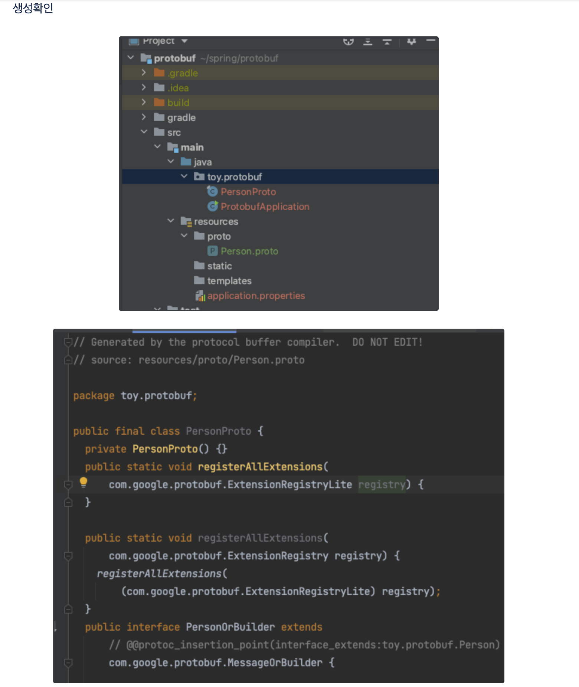
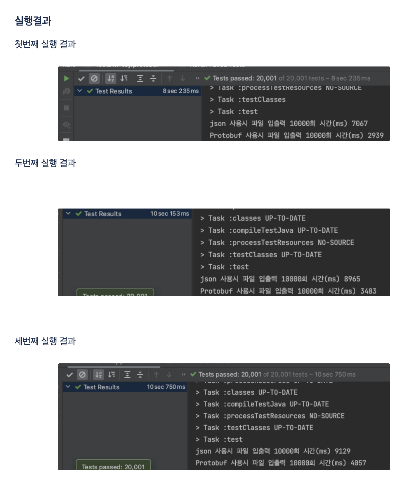

# protobuf_vs_json
## protobuf 와 json 의 성능 비교

목적 : Serialization 관점에서 protobuf 와 json 중 어느것이 더 빠른 지 비교하는 테스트


### 작업 

환경 : 자바 8, gradle, intellij CE, macOS


```
// https://mvnrepository.com/artifact/com.google.protobuf/protobuf-java
implementation group: 'com.google.protobuf', name: 'protobuf-java', version: '3.19.4'

```


resources/proto/Person.proto

```protobuf
syntax = "proto3";

package toy.protobuf;

option java_package = "toy.protobuf";
option java_outer_classname = "PersionProtos";

message Person {
  int32 id = 1;
  string name = 2;
  string email = 3;
  repeated PhoneNumber phone = 4;
  message PhoneNumber {
      string number = 1;
      string type = 2;

  }
}
```


.proto 파일 컴파일

```
 protoc --java_out=java resources/proto/Person.proto

```





### 결과



= 파일입출력 시   Protobuf 의 시간이 빠른 것을 확인

 

## 결론

- serialization 시 protobuf 가 성능이 우수한 것을 확인
- 러닝 커브와 클라이언트와 호환성을 생각할 때 public api 경우 json, internal api 같은 경우 protobuf를 사용하는 것을 권장. xml 은 최근 거의 사용하지 않음
